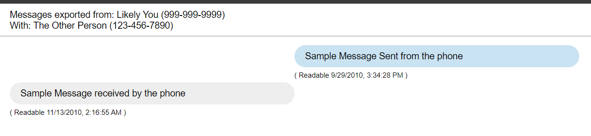

# XmlSmsToReactLibrary

This project exists due to 2 reasons:

  - I use SMS Backup & Restore and had a need to transform the XML Backup into a nice UI to print it as PDF.
  - I needed a working example of a library in React & TypeScript bundled using ESBuild as ESM modules ([lib directory](./lib)), then load those ESM modules into an integration app ([src directory](./src)).

It is meant to produce something like the following:

## Development

1. `$ pnpm install`
2. Copy `.env.dev` to a file `.env` and change the environment variables to what you need.
3. `pnpm start`

All build scripts are done using the `esbuild.ts` file.

Some notes:

 - Library changes are saved to `node_modules` and `public` on every change in `lib`.
 - Bundle changes are saved to `public` on every change in `src`.
 - React and React Dom are External Libraries (to find out how to get it working).
 - Compiling scripts are done using TypeScript (to find out how to get it working).